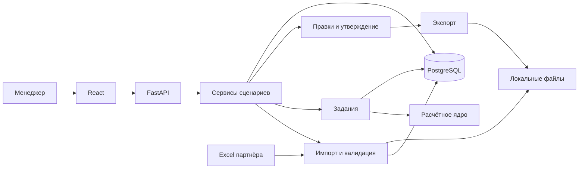

# Архитектура

Статус: частичная реализация. Работают адаптеры чтения/профилирование Excel,
базовый прогноз и чистый расчёт потребности через CLI. PostgreSQL, API, worker,
frontend и согласование заказов ниже описаны как целевая архитектура.

## Решение

Монорепозиторий с React-интерфейсом и модульным Python-приложением. PostgreSQL — основная база, файловое хранилище — локальная директория с ограниченным доступом. Расчётное ядро не зависит от HTTP, базы, Excel и интерфейса.

Для общего веб-MVP выбран PostgreSQL вместо локального варианта SQLite из первоначального обсуждения: нужны совместная работа, версии заказов и транзакционное утверждение. Redis, распределённая очередь, микросервисы и LLM в начальную архитектуру не входят.

## Границы backend

| Директория | Ответственность | Ограничения |
|---|---|---|
| `app/api/` | Маршруты, HTTP-проверки, преобразование запросов и ответов | Не рассчитывает прогноз, не разбирает Excel |
| `app/core/` | Настройки, журналирование, идентификация и полномочия | Не содержит товарных правил |
| `app/db/` | Соединение, ORM-модели, запросы и транзакции | Не определяет алгоритм закупки |
| `app/modules/imports/` | Разбор форматов, нормализация, проверка, активация набора данных | Не подменяет неизвестное нулём и не изменяет исходники |
| `app/modules/catalog/` | Товары, поставщики, склады, категории, ограничения поставок | Не выдумывает значения справочников |
| `app/modules/calculations/` | Снимок входов, запуск ядра, сохранение результата и объяснений | Не зависит от изменяемых входов после запуска |
| `app/engine/` | Чистые преобразования спроса, прогноз и расчёт потребности | Без FastAPI, SQLAlchemy, файловых операций и состояния пользователя |
| `app/modules/orders/` | Черновики, версии, изменения, утверждение и аудит | Не меняет исходную рекомендацию |
| `app/modules/exports/` | Формирование файлов по утверждённой версии | Не утверждает и не отправляет заказ |
| `app/jobs/` | Очередь выполнения, статусы, ошибки и восстановление | Не выполняет расчёты внутри HTTP event loop |

Зависимости: API → сервисы модулей → расчётное ядро и слой хранения. Ядро получает типизированный снимок данных, возвращает результат и шаги объяснения. Модули взаимодействуют через публичные сервисы; доступ к PostgreSQL сосредоточен в `db/`. Скрытые перекрёстные вызовы маршрутов запрещены.

## Расчётное ядро

| Файл | Назначение |
|---|---|
| `contracts.py` | Входы/выходы ядра, единицы, неизвестные значения и предупреждения |
| `outliers.py` | Крупные разовые документы и покупки анонимного клиента |
| `stockouts.py` | Восстановление спроса в подтверждённые периоды отсутствия |
| `forecast.py` | Базовый уровень, сезонность, устойчивый тренд и внешний прирост |
| `replenishment.py` | Горизонт покрытия, запас, поступления по датам, MOQ и кратность |
| `explanations.py` | Структурированное обоснование из промежуточных вычислений |

Последовательность: нормализованные продажи → выделение разового спроса → компенсация stockout → прогноз → календарная проекция остатка → количество и срочность → объяснение. Передача промежуточных результатов явная. Идентичные входы, параметры и версия алгоритма должны давать одинаковый результат.

## Импорт и вычисления

Импорт состоит из загрузки, определения формата, разбора во временный набор, валидации и активации. Ошибочный импорт не заменяет рабочие данные. Повторная загрузка идентичного файла распознаётся по контрольной сумме и контексту источника. Повторяющиеся документы и перекрывающиеся периоды проверяются отдельно от хеша файла.

Набор расчёта связывает версии всех использованных источников и параметры на дату среза. Позднейший импорт не меняет прошлый расчёт. Данные после даты среза не используются как факты; будущие известные поступления учитываются как планы.

API создаёт сохраняемое задание и возвращает его идентификатор. Один исполнитель забирает задания из PostgreSQL с защитой от двойного захвата, запускает тяжёлую работу вне процесса обработки HTTP. Состояния: `queued → running → succeeded / failed`. При перезапуске зависшие задания обнаруживаются по времени последнего сигнала; незавершённые результаты не публикуются. Повторный запуск должен быть идемпотентным. Worker использует тот же backend-пакет; это не отдельный бизнес-сервис.

## Заказы и доступ

Роли MVP: просмотр и менеджер закупок. Сервер проверяет полномочия на изменение и утверждение. Способ аутентификации согласовать до публикации сервиса; до его реализации возможна только локальная демонстрация с явно обозначенным тестовым пользователем.

Заказ: `draft → reviewed → approved`. Экспорт — событие для утверждённой версии, а не новый статус согласования. Изменение утверждённого заказа создаёт новую черновую версию; предыдущая остаётся доступной. При изменениях проверяется номер версии, конфликт возвращается пользователю. Утверждение и запись аудита происходят в одной транзакции.

Рекомендованное и согласованное количество хранятся отдельно. У каждой правки есть автор, время и причина. Отправка поставщику не входит в MVP. Экспорт возможен только после серверной проверки утверждения актуальной версии.

## Интерфейс

`pages/` содержит экраны, `features/` — сценарии работы, `shared/` — клиент API, общие элементы и типы, `app/` — подключение маршрутов и провайдеров. Бизнес-расчёты выполняются на backend; frontend показывает результат и собирает параметры.

Экраны: импорт и качество данных; настройки расчёта; рекомендации по поставщикам; подробности SKU; список заказов и согласование. Длинные таблицы получают фильтрацию и пагинацию на сервере. Статус фоновой работы запрашивается периодически; WebSocket для MVP не требуется.

## Эксплуатация

Один PostgreSQL, API, один worker и frontend. Сырьевые файлы и экспорт доступны через проверяемые API, а не как публичная статика. Имена загрузок задаёт сервер, исходное имя сохраняется в метаданных. Ограничения размера/формата и диагностические сообщения определяются при реализации импорта.

Не записывать сырые продажи, клиентские идентификаторы и секреты в журналы. Новые реальные данные остаются вне Git. Срок хранения файлов и резервное копирование согласовать до рабочего использования. Совместимость экспорта с 1С проверяется на предоставленном партнёром шаблоне.
